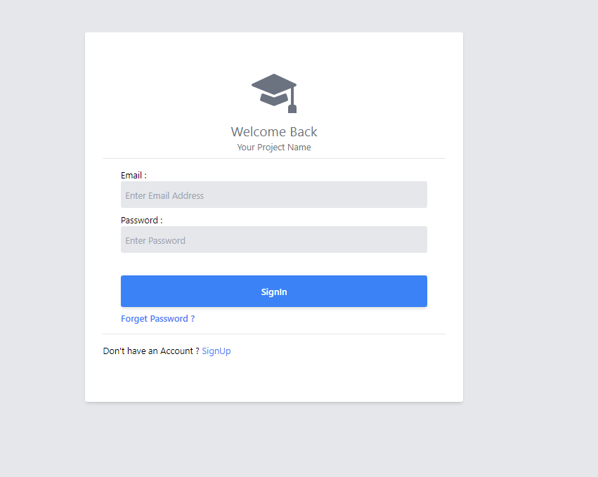
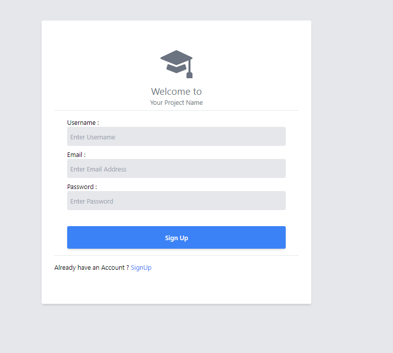

# Login SignUp React Template

- This NPM Package is Develop for ReactJS Frontend Developers to make development easy.
- The one Command make the all Login Sign Up interfaces

# Releases

## v1.0.0 - 27 May 2024

- Initial release of the Project
- only for Login(signin)

## v1.1.0 - 28 May 2024

- Updating Package
- Adding SignIn Interface

## v2.0.0 - 02 June 2024

- Updating Package
- Adding Custom CSS login and Signup Forms

# IMPORTANT Notice

- This NPM package works with <b>ReactJS</b> Projects (from in v2.0.0)
- This NPM package works only with <b>ReactJS + Vite + Tailwind CSS</b> Projects (in v1.1.0)
- The Common Working NPM Package will be Released in the Future.

# How to use this NPM Package

- Important
- - use NPM scripts according to your needs
- - use only on script


- Before install the Package you must install following Packages

- - react-router-dom
- - axios

- after install above packages

- install using following NPM script

``` 
    npm i login-signup-react

```

- and then go to your `package.json` file 
- find `scripts`
- add following commands

- Use with Custom CSS
- Use Tailwind CSS


### Use with Custom CSS

```json

    "SignInUp": "node -e \"require('login-signup-react').RunReactLoginSignIn()\"",

```


``` json  

  "scripts": {
    "dev": "vite",
    "build": "vite build",
    "serve": "vite preview",
    "SignInUp": "node -e \"require('login-signup-react').RunReactLoginSignIn()\"",
  },

```

- after that run the command

```

    npm run SignInUp

```

- after you running the command you can see a folder `LoginSignUp` in path `src/components` in your Project

- after done this you have to update App.jsx file in the project

``` jsx


import { BrowserRouter, Route, Routes } from "react-router-dom";
import SignIn from "./components/LoginSignUp/SignIn"; // Importing the Templete the created by run npm package
import SignUp from "./components/LoginSignUp/SignUp"; // Importing the Templete the created by run npm package

export default function App() {
  return (
    <BrowserRouter>
      <Routes>

        {/* declare the Route */}
        {/* the path can change whatever you want */}
        <Route path="/" element={<SignIn />} /> 
        <Route path="/SignUp" element={<SignUp />} /> 

      </Routes> 
    </BrowserRouter>
  )
}
```
<hr>


### Use Tailwind CSS

```json

    "SignInUpTW": "node -e \"require('login-signup-react').RunReactLoginSignInTW()\""

```


``` json  

  "scripts": {
    "dev": "vite",
    "build": "vite build",
    "serve": "vite preview",
    "SignInUpTW": "node -e \"require('login-signup-react').RunReactLoginSignInTW()\""
  },

```

- after that run the command

```

    npm run SignInUp

```

- after you running the command you can see a folder `LoginSignUpTW` in path `src/components` in your Project

- after done this you have to update App.jsx file in the project

``` jsx


import { BrowserRouter, Route, Routes } from "react-router-dom";
import SignIn from "./components/LoginSignUpTW/SignIn"; // Importing the Templete the created by run npm package
import SignUp from "./components/LoginSignUpTW/SignUp"; // Importing the Templete the created by run npm package

export default function App() {
  return (
    <BrowserRouter>
      <Routes>

        {/* declare the Route */}
        {/* the path can change whatever you want */}
        <Route path="/" element={<SignIn />} /> 
        <Route path="/SignUp" element={<SignUp />} /> 

      </Routes> 
    </BrowserRouter>
  )
}
```
<hr>


# Screen Shorts 

- outputs are same in both scripts





# License and copyright notice of Package

- The Package Licensed Under ISC

# Developers and Designers

- [JehanKandy](https://github.com/BackendExpert)

- [Anupa Gamage](https://github.com/anupa1998)
